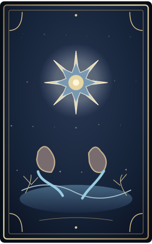

# Sendero vivo + tarot ilustrado · El Reino de los 33

Esta actualización no modifica Apps Script, la ubicación privada, el backend RSVP, los tokens ni el contador.

## Archivos

- `efectos-magicos.js`: reemplaza por completo el archivo anterior del mismo nombre.
- `sendero.css`: archivo nuevo en la raíz, junto a `index.html`.
- `assets/tarot/*.svg`: ocho ilustraciones originales. Copia toda la subcarpeta `tarot` dentro de `assets`.
- `vista-cartas.png`: vista previa, NO necesitas subirla al sitio.

## Tres cambios en index.html

**A. Referencias de archivos:** mantén `styles.css` y `script.js` como están. Al final de `<head>` deja estas referencias, en este orden:

```html
<link rel="stylesheet" href="efectos-magicos.css?v=2" />
<script src="efectos-magicos.js?v=3" defer></script>
<link rel="stylesheet" href="sendero.css?v=1" />
```

**B. Ilustración en el frente de la carta:** dentro de `<span class="tarot-cara tarot-cara-frente">`, antes de `<span id="tarotNombre" ...>`, añade:

```html

```

**C. No hace falta HTML adicional para las enredaderas o las luciérnagas.** El nuevo `efectos-magicos.js` las crea automáticamente.

## Recomendación de rendimiento

En `script.js`, al final, si aparece:

```js
crearLuciernagas("luciernagasPortal", 100);
crearLuciernagas("luciernagasHero", 120);
```

cámbialo por:

```js
crearLuciernagas("luciernagasPortal", 18);
crearLuciernagas("luciernagasHero", 12);
```

Conservas el brillo en la portada y dejas que las nuevas luciérnagas globales recorran la página. Si cambias `script.js`, aumenta su parámetro `?v=` en `index.html` para evitar la caché de Safari.

## Prueba rápida

1. Abre Live Server, toca «Abrir el portal» y desplázate lentamente.
2. Las enredaderas a ambos lados deben dibujarse gradualmente con el desplazamiento.
3. El fondo deja de parecer tarjetas separadas; el dress code toma forma de inscripción/pergamino.
4. La carta gira, muestra una ilustración de uno de los ocho arcanos y luego revela el mensaje de Isaac.
5. Mapa y RSVP deben seguir intactos con un enlace de invitado de prueba.
6. Sube el archivo JS reemplazado, el CSS nuevo, las ocho ilustraciones y `index.html` a GitHub Pages. No subas una lista de invitados ni tokens.

Para usuarios con «Reducir movimiento», no habrá desplazamientos ni giros, pero las cartas se revelarán igualmente.
